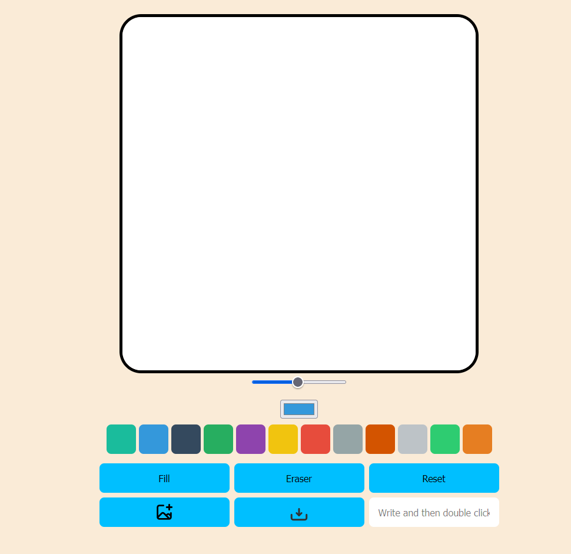
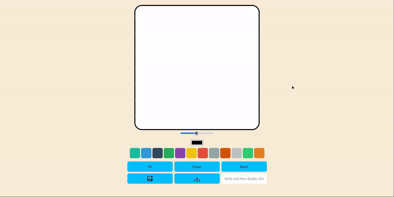
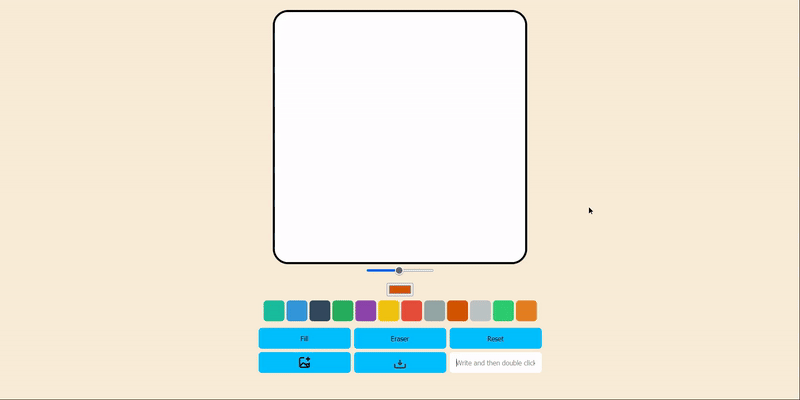

# # Paint JS

### canvas element를 공부하면서 만들어 봤습니다.

### 사용한 기술 스택:

- ### HTML, CSS, JS

### 배포된 앱 [URL](https://zpdl95.github.io/paintJS/)

## 첫 화면

## 그림 그리기

## 굵기 변경

## 색상 변경

## 색 채우기

## 지우기

## 초기화

## 이미지 추가

## 글자 추가

## 이미지 저장

## 만들면서 느낀점

### canvas element에 정말 다양한 기능이 있다는것을 알았습니다.

### 마우스이벤트로만 만들었지만 터치이벤트로도 동작하도록 만들고 싶습니다.
